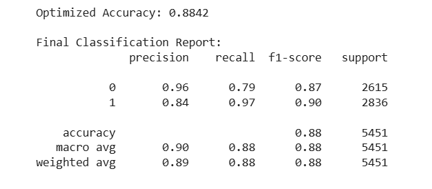

[**Home**](/) | [**Next Project: Customer Churn**](project2) | [**LinkedIn**](https://www.linkedin.com/in/adina-kaplan/) | [**Email**](mailto:adina.kaplan613@gmail.com) | [**Resume**](resume.pdf)

---

# Proactive Risk Modeling for NYC Intersections

## Project Overview
This project developed a data-driven framework to shift intersection management from reactive safety measures to **proactive risk identification**. I architected a machine learning model designed to identify "Risk Signatures" at uncontrolled intersections, providing a scalable method for cities to prioritize safety interventions before accidents occurs.

---

## My Role: Machine Learning Architect & Stakeholder Liaison
In this collaborative project, I was responsible for the **Predictive Modeling** and **Strategic Analysis** phase. My role focused on transforming processed data into actionable business intelligence:

* **Model Architecture:** Designed and implemented a Random Forest Classifier to identify non-linear risk patterns across NYC infrastructure.
* **Metric Optimization:** Strategically tuned the model to prioritize **Recall (97%)**, ensuring the framework minimized "False Negatives" in public safety assessments.
* **Feature Strategy:** Collaborated with the data engineering lead to ensure spatial features and crash histories were structured to maximize model predictive power.
* **Stakeholder Communication:** Authored the technical proposal to translate complex model outputs and performance metrics into a clear strategy for non-technical decision-makers.

## Technical Methodology

### 1. High-Precision Spatial Engineering
To ensure administrative "Unknowns" did not lead to safety gaps, I utilized the **EPSG:2263 (New York State Plane)** coordinate system. By utilizing a foot-based grid rather than standard latitude/longitude, I performed 50ft spatial joins to accurately link over 100,000 crash records to physical infrastructure.

### 2. Random Forest Classification
I implemented a **Random Forest Classifier** with 200 decision trees to identify non-linear relationships between intersection infrastructure and crash frequency. This approach ensured stable results across NYC’s diverse street network and prevented overfitting.

### 3. Metric Optimization: Prioritizing Recall
In public safety, the cost of a "False Negative" (missing a high-risk site) is significantly higher than a "False Positive" (an unnecessary audit). I tuned the model to prioritize **Recall (97%)**, ensuring the vast majority of historically dangerous locations were successfully flagged.

---

## Key Results & Findings
* **Model Performance:** The system achieved an overall **Accuracy of 88.4%**, specifically optimized to identify high-risk safety profiles.
* **High-Risk Recall:** By strategically tuning the model, I achieved a **97% Recall rate**, ensuring that the vast majority of historically dangerous locations were successfully flagged for audit.
* **Geographic Insights:** Analysis revealed that **87% of high-risk uncontrolled intersections** in the study were concentrated in the **Bronx (55%)** and **Staten Island (32%)**.
* **Public Reporting Correlation:** Data revealed that high-risk sites averaged over **61 citizen complaints**, proving a measurable link between public feedback and infrastructure risk.

---

## Technical Performance
Below is the Confusion Matrix demonstrating the model’s success in capturing high-risk categories through optimized recall.

---

## Project Artifacts
* [**Analysis and Findings**](nyc_traffic_paper.pdf): A detailed strategy for transitioning from reactive to proactive safety management.
* [**Model Architecture Code**](nyc_traffic_model.html): Python implementation of the Random Forest Classifier, including the strategic recall optimization.
* **Actionable Priority List:** A generated "Top 100" list for targeted infrastructure audits.
* **Core Technical Stack:** Python (Scikit-Learn, Pandas, NumPy).

---
